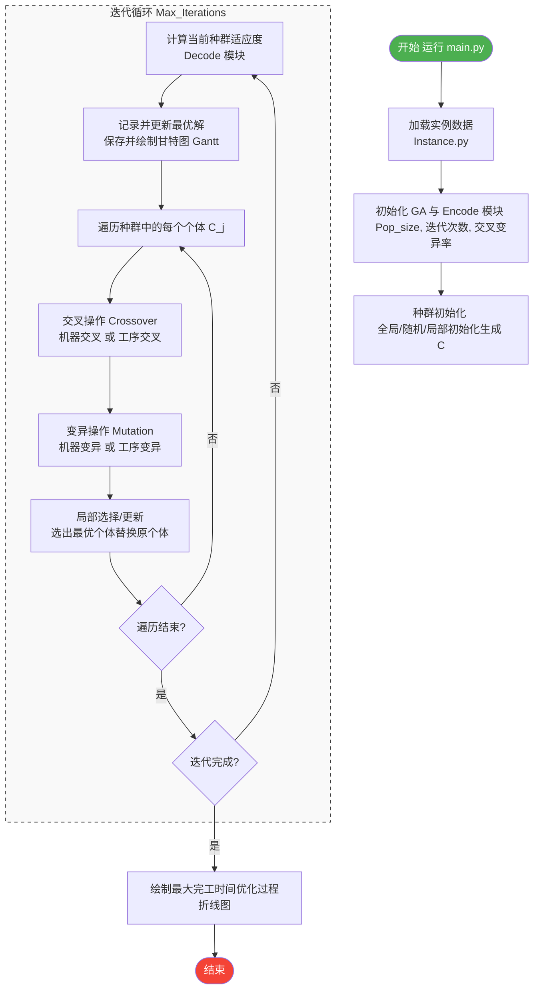

# 遗传算法 (GA) 流程说明

以下是 `main.py` 运行的核心逻辑流程图：

```mermaid
graph TD
    A([开始 运行 main.py]) --> B[加载实例数据 <br/>Instance.py]
    B --> C[初始化 GA 与 Encode 模块 <br/>Pop_size, 迭代次数, 交叉变异率]
    C --> D[种群初始化 <br/>全局/随机/局部初始化生成 C]
    
    subgraph Iteration [迭代循环 Max_Iterations]
        E[计算当前种群适应度 <br/>Decode 模块] --> F[记录并更新最优解 <br/>保存并绘制甘特图 Gantt]
        F --> G[遍历种群中的每个个体 C_j]
        G --> H[交叉操作 Crossover <br/>机器交叉 或 工序交叉]
        H --> I[变异操作 Mutation <br/>机器变异 或 工序变异]
        I --> J[局部选择/更新 <br/>选出最优个体替换原个体]
        J --> K{遍历结束?}
        K -- 否 --> G
        K -- 是 --> L{迭代完成?}
        L -- 否 --> E
    end

    L -- 是 --> M[绘制最大完工时间优化过程折线图]
    M --> N([结束])

    %% 样式美化
    style Iteration fill:#f9f9f9,stroke:#333,stroke-dasharray: 5 5
    style A fill:#4CAF50,color:#fff
    style N fill:#f44336,color:#fff
```
